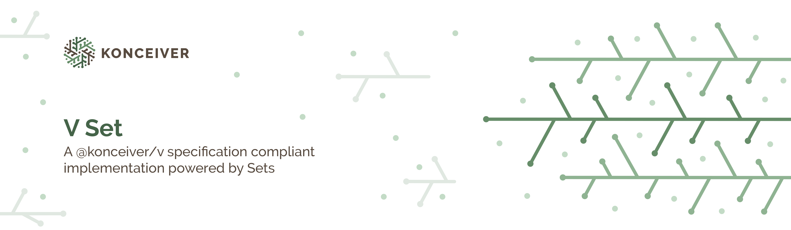

# @konceiver/v-set

<p align="center"></p>

[](https://www.npmjs.com/package/@konceiver/v-set)
[](./LICENSE)
[](https://img.shields.io/github/workflow/status/konceiver/v-set/CI?label=CI)
[](https://npmjs.org/package/@konceiver/v-set)

## Installation

```bash
yarn add @konceiver/v-set
```

## Testing

```bash
yarn test
```

## Security

If you discover a security vulnerability within this package, please send an e-mail to security@konceiver.dev. All security vulnerabilities will be promptly addressed.

## Credits

This project exists thanks to all the people who [contribute](../../contributors).

## License

This is free and open source software under the terms of the [MIT License](./LICENSE).
